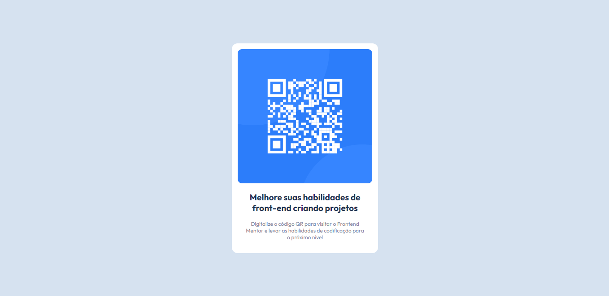

# Frontend Mentor - solução de componente de código QR

Esta é uma solução para o [desafio do componente de código QR no Frontend Mentor](https://www.frontendmentor.io/challenges/qr-code-component-iux_sIO_H). Os desafios do Frontend Mentor ajudam você a melhorar suas habilidades de codificação criando projetos realistas.

## Índice

- [Visão geral](#visão geral)
  - [Captura de tela](#captura de tela)
  - [Links](#links)
- [Meu processo](#meu-processo)
  - [Construído com](#construído com)
  - [O que aprendi](#o-que-aprendi)
  - [Desenvolvimento contínuo](#desenvolvimento contínuo)
- [Autor](#autor)

## Visão geral

### Captura de tela



### Links

- URL do site ao vivo: (https://bitlip25.github.io/QR-code-component-/)

## Meu processo

### Construído com

- Marcação HTML5 semântica
- Propriedades personalizadas CSS
- Flexbox

### O que eu aprendi

Aprendi melhor o basico de flexbox, comecei a enternder o github e fiz meu primeiro site no gitpage, ficou um pouco diferente da versão do vscode mas não o suficiente para incomodar.

```html
<h1>Melhore suas habilidades de front-end criando projetos</h1>
```

```css
.container {
  padding: 16px;
  width: 340px;
  background-color: hsl(0, 0%, 100%);
  border-radius: 24px;
  box-shadow: 0px 4px 24px #888888;
}
```

### Desenvolvimento contínuo

Já me sinto confotavel com meu conhecimento de HTML e CSS, meu proximo passo é tentar um framework de CSS ando pensando muito em tailwind css, então vou me arriscar nele no projeto seguinte, vou começar meu estudos em Js na proxima semana

## Autor

- Frontend Mentor - [@ BitLip25](https://www.frontendmentor.io/profile/BitLip25)
